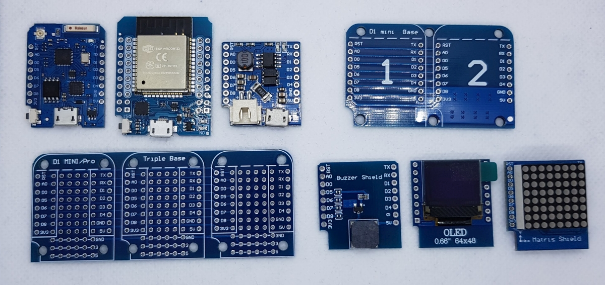

The D1 mini is really special for the ESP Family. 
It has like the arduino many expansion shields which eases a first setup for beginners.
Therefor I spend an own Git project for this board. See also my other checks of ESP and Arduino boards.

Used Libs:

Only Arduino Ethernet and SD card

Visit http://www.fambach.net for more infos