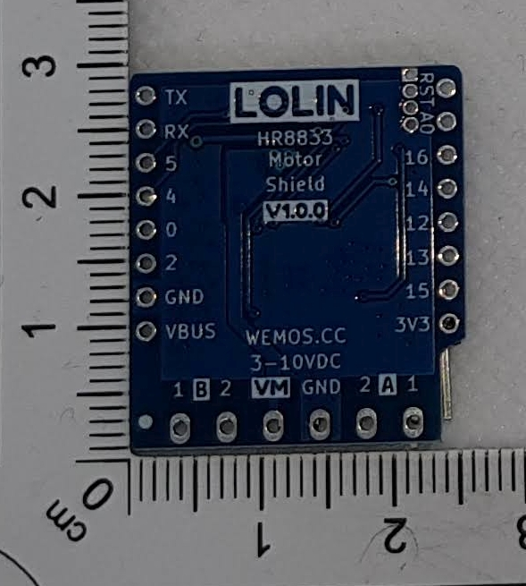

Shield for D1 Mini
#Description
HR8833Motor Shield with Motor driver for two motors (3V-10V)
https://www.wemos.cc/en/latest/d1_mini_shield/hr8833_motor.html

# Images 

## Front

## Back

#Used Libs
https://github.com/wemos/LOLIN_I2C_MOTOR_Library

Visit http://www.fambach.net for more infos