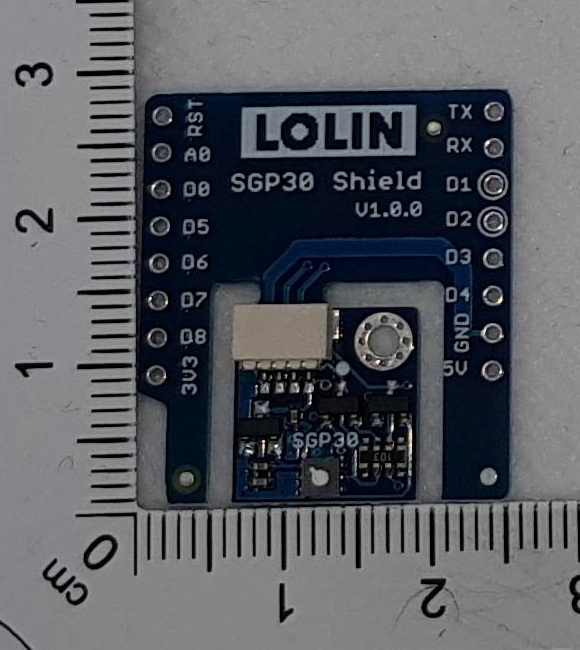
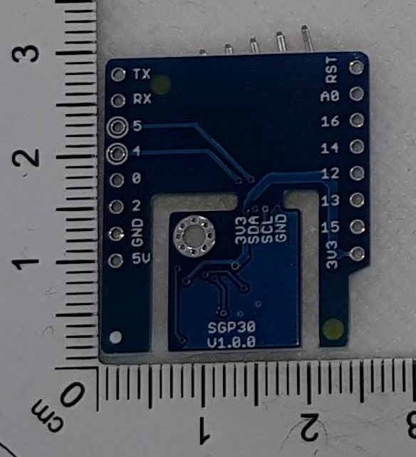

Shield for D1 Mini
#Description
I2C Interface TVOC and eCO2 sensor shield based SGP30
https://www.wemos.cc/en/latest/d1_mini_shield/sgp30.html

# Images 

## Front

## Back

#Used Libs
https://github.com/adafruit/Adafruit_SGP30

Visit http://www.fambach.net for more infos